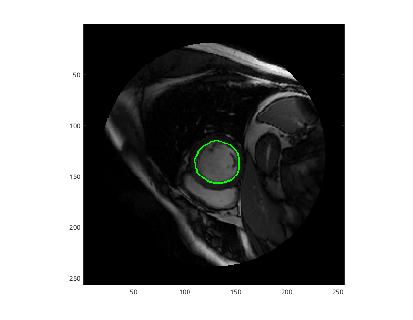

# Cardiac cine segmentation with MATLAB
This repository implements U-Net segmentation of the left ventricle from cardiac MRI data in an [MRD streaming protocol](https://ismrmrd.readthedocs.io/en/latest/mrd_streaming_protocol.html) compatible server.  It is based off the example provided by The MathWorks as part of their Deep Learning Toolbox as detailed at https://www.mathworks.com/help/deeplearning/ug/cardiac-left-ventricle-segmentation-from-cine-mri-images.html.  It is built on top of the [matlab-ismrmrd-server](https://github.com/kspaceKelvin/matlab-ismrmrd-server) repository.

To run the U-Net model, the Image Processing, Computer Vision, and Deep Learning toolboxes are required.  The Instrument Control and MATLAB Compiler toolboxes are additionally required to run the MRD server component and compile/build the code into a container.  If packaging into a Docker image, Linux must be used (can be in a virtual machine).

## Download the pre-trained network and example images
Pre-trained network weights are provided by The MathWorks and must be downloaded separately from this repository:
```matlab
modelzipfile = "pretrainedLeftVentricleSegmentation.zip";
websave(modelzipfile, "https://ssd.mathworks.com/supportfiles/medical/pretrainedLeftVentricleSegmentation.zip");
unzip(modelzipfile);
```

Example DICOM images are also [available from The MathWorks](https://www.mathworks.com/help/deeplearning/ug/cardiac-left-ventricle-segmentation-from-cine-mri-images.html).  The included [RunExampleSegmentation.m](RunExampleSegmentation.m) file contains example code for running the segmentation network and displaying the results.  The result should appear as an image plus a polygon ROI showing the segmentation result:



## Setting up the MRD Server
This repository is intended to be used in conjunction with the [matlab-ismrmrd-server](https://github.com/kspaceKelvin/matlab-ismrmrd-server) repository and the MRD server functionality cannot be used without it.  This repository implements only the [segmentheart.py](segmentheart.py) module that is called by matlab-ismrmrd-server and does not duplicate the code from matlab-ismrmrd-server.  This allows matlab-ismrmrd-server to be updated without changing the code in this repository.

To use these repositories together, download the [matlab-ismrmrd-server](https://github.com/kspaceKelvin/matlab-ismrmrd-server) repository, browse to that folder from within MATLAB, and add it to the path using `addpath('.')`.  Then browse back to this repository's folder.

## Building a Docker image
Building a MATLAB Docker image allows the segmentation to be run as an MRD server in an easy-to-deploy container that does not require a MATLAB license at runtime.  This step must be run in Linux, either natively or within a virtual machine.

The following code can be used to build the Docker image:
```matlab
res = compiler.build.standaloneApplication(which('fire_matlab_ismrmrd_server.m'), 'AdditionalFiles', 'segmentheart.m')
opts = compiler.package.DockerOptions(res, 'ImageName', 'mrd-matlab-segmentlv', 'AdditionalInstructions', {'CMD ["9002", "", "segmentheart"]'})
compiler.package.docker(res, 'Options', opts)
```

This is a two-step process consisting of compiling the code into an executable application, and then creating a Docker image with the necessary [MATLAB Compiled Runtime environment](https://www.mathworks.com/products/compiler/matlab-runtime.html).

During the `compiler.build.standaloneApplication` step, the `AdditionalFiles` argument is used to indicate that `segmentheart.m` will be needed because this dependency cannot be determined by automatically.

When setting the Docker build options using `compiler.package.DockerOptions`, the `AdditionalInstructions` is used with the [`CMD` Docker instruction](https://docs.docker.com/reference/dockerfile/#cmd).  This specifies the arguments to be passed to [fire_matlab_ismrmrd_server.m](fire_matlab_ismrmrd_server.m), specifically the server port number (9002), the log file (blank), and the default config to be run (segmentheart).  Note that the `AdditionalInstructions` argument is only available [starting in R2022b], so for earlier versions, this may be omitted.  The port number, log file, and default config could then be set manually by other means.

Building a Docker image for the first time may take a few minutes for the required files to be downloaded.  Subsequent builds are significantly faster.

After complete, the Docker image can be started with:
```
docker run --rm -p 9002:9002 mrd-matlab-segmentlv
```

Due to limitations in how MATLAB Docker containers are executed, it cannot be stopped using ctrl+c.  Instead, open a new terminal window and run `docker ps` to identify the running containers.  Identify the container's name (right-most column) and run `docker kill container_name` to stop the server.